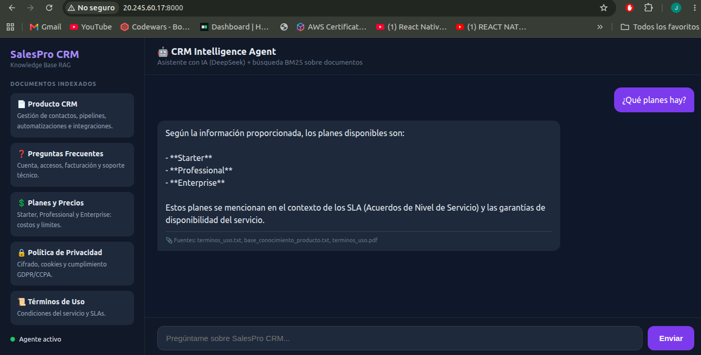

# 🤖 CRM Intelligence - Alura Challenge

> Sistema CRM inteligente con Agente IA conversacional usando RAG (Retrieval Augmented Generation)


---

## 📋 Descripción

**SalesPro CRM Intelligence** es un sistema completo de gestión de relaciones con clientes (CRM) potenciado por un agente de inteligencia artificial que responde preguntas en tiempo real utilizando documentos PDF, TXT y CSV.

### ✨ Características principales

- 🤖 **Agente IA conversacional** con RAG usando DeepSeek
- 📄 **Base de conocimiento** con 5 PDFs + 5 TXT + 1 CSV
- 🎨 **Interfaz moderna** React con dashboard interactivo
- 📊 **Dashboard CRM** con métricas, contactos y pipeline
- ➕ **Crear contactos** con modal funcional
- 🔍 **Búsqueda BM25** sin necesidad de embeddings
- 📚 **Fuentes citadas** en cada respuesta del agente
- 🌐 **API REST** documentada con FastAPI

---

## 🚀 Despliegue (Deployment)

La aplicación está **contenida en Docker** y desplegada en un **servidor Linux (Azure VPS)** con acceso por SSH.

**🌐 Demo en vivo:** http://20.245.60.17:8000

### Cómo se desplegó

1. Servidor **Ubuntu 24.04** en Azure (máquina virtual / VPS).
2. Instalación de **Docker** en el servidor.
3. Clonación del repositorio desde GitHub.
4. Construcción de la imagen: `docker build -t asistente-ia .`
5. Ejecución del contenedor pasando la API key como variable de entorno:
   ```bash
   docker run -d --restart unless-stopped -p 8000:8000 \
     -e DEEPSEEK_API_KEY="tu_clave" asistente-ia
   ```
6. Apertura del puerto **8000** en el firewall de Azure (Network Security Group).

### 📸 Evidencia del despliegue



> ℹ️ El servidor de demo es temporal (crédito de estudiante de Azure). El proyecto
> se puede redesplegar con los mismos comandos en cualquier VPS.

---

## 🏗️ Arquitectura

```
┌────────────────────────────────────────────────┐
│           USUARIO (Navegador)                  │
└───────────────────┬────────────────────────────┘
                    │
                    ↓
┌────────────────────────────────────────────────┐
│         FRONTEND (React + Vite)                │
│  - Dashboard con métricas                      │
│  - Gestión de contactos                        │
│  - Pipeline de ventas (Kanban)                 │
│  - Chat con Agente IA                          │
│  Puerto: 5173                                  │
└───────────────────┬────────────────────────────┘
                    │ HTTP REST
                    ↓
┌────────────────────────────────────────────────┐
│         BACKEND (FastAPI)                      │
│  POST /query  → Consultas al agente            │
│  GET  /health → Health check                   │
│  Puerto: 8000                                  │
└───────────────────┬────────────────────────────┘
                    │
                    ↓
┌────────────────────────────────────────────────┐
│       AGENTE IA (LangChain + DeepSeek)         │
│  ┌──────────────┐      ┌──────────────┐       │
│  │  BM25        │ ───→ │  DeepSeek    │       │
│  │  Retriever   │      │  LLM         │       │
│  │  (k=3)       │      │ (temp: 0.3)  │       │
│  └──────────────┘      └──────────────┘       │
└───────────────────┬────────────────────────────┘
                    │
                    ↓
┌────────────────────────────────────────────────┐
│      BASE DE CONOCIMIENTO (docs/)              │
│  📄 5 PDFs  +  📝 5 TXT  +  📊 1 CSV           │
│  Total: 21 documentos indexados                │
└────────────────────────────────────────────────┘
```

---

## 🚀 Tecnologías

### Backend
- **Python 3.10+**
- **FastAPI** - Framework web moderno
- **LangChain** - Orquestación de LLM
- **DeepSeek** - Modelo de lenguaje (compatible con OpenAI API)
- **BM25Retriever** - Búsqueda léxica (sin embeddings)
- **PyPDF** - Lectura de PDFs
- **Uvicorn** - Servidor ASGI

### Frontend
- **React 19.2** - UI moderna
- **Vite 8** - Build tool rápido
- **Lucide React** - Iconos
- **CSS Modules** - Estilos

---

## 📁 Estructura del Proyecto

```
proyecto-asistente/
│
├── docs/                           # 📚 Base de Conocimiento
│   ├── base_conocimiento_producto.pdf + .txt
│   ├── faq_soporte.pdf + .txt
│   ├── manual_usuario.pdf + .txt   ⭐ Guía completa
│   ├── politica_privacidad.pdf + .txt
│   ├── terminos_uso.pdf + .txt
│   └── planes_precios.csv
│
├── src/                            # 🐍 Backend Python
│   ├── agent.py                    # Agente RAG principal
│   └── api.py                      # API REST FastAPI
│
├── frontend/                       # ⚛️ Frontend React
│   ├── src/
│   │   ├── App.jsx                # CRM completo
│   │   ├── App.css
│   │   ├── main.jsx
│   │   └── index.css
│   ├── public/
│   ├── package.json
│   └── vite.config.js
│
├── scripts/
│   └── txt_to_pdf.py              # Conversor TXT → PDF
│
├── templates/
│   └── index.html                 # HTML básico
│
├── .env                            # 🔐 Variables de entorno
├── .env.example
├── requirements.txt
├── test_agent.py
├── README.md                       # 📖 Este archivo
└── DOCUMENTACION.md                # 📘 Docs técnica completa
```

---

## 🛠️ Instalación

### 1️⃣ Requisitos previos

- Python 3.10+
- Node.js 18+
- npm o yarn
- Cuenta en [DeepSeek](https://platform.deepseek.com/) (para API key)

### 2️⃣ Clonar repositorio

```bash
git clone <tu-repo>
cd proyecto-asistente
```

### 3️⃣ Backend: Configurar Python

```bash
# Crear entorno virtual
python3 -m venv venv
source venv/bin/activate  # Linux/Mac
# venv\Scripts\activate   # Windows

# Instalar dependencias
pip install -r requirements.txt

# Configurar variables de entorno
cp .env.example .env
nano .env  # Agregar tu DEEPSEEK_API_KEY
```

**Contenido de `.env`:**
```bash
DEEPSEEK_API_KEY=sk-xxxxxxxxxxxxxxxxxxxxxxxx
```

### 4️⃣ Frontend: Configurar React

```bash
cd frontend
npm install
```

### 5️⃣ Verificar documentos

```bash
ls -lh docs/
# Debe mostrar: 5 PDFs + 5 TXT + 1 CSV (11 archivos)
```

---

## 🚀 Ejecutar el Proyecto

### Opción A: Dos terminales (Recomendado)

**Terminal 1 - Backend:**
```bash
source venv/bin/activate
uvicorn src.api:app --reload --host 0.0.0.0 --port 8000
```

Verás:
```
✅ 21 documentos cargados exitosamente
INFO: Uvicorn running on http://0.0.0.0:8000
```

**Terminal 2 - Frontend:**
```bash
cd frontend
npm run dev
```

Verás:
```
VITE v8.1.1  ready in 234 ms

➜  Local:   http://localhost:5173/
```

### Opción B: Script único (próximamente)

```bash
./start.sh  # Inicia backend + frontend
```

---

## 💻 Uso del Sistema

### 1. Abrir en navegador

```
http://localhost:5173
```

### 2. Explorar el CRM

#### 📊 Dashboard
- Ver métricas: MRR, contactos activos, tasa de conversión
- Gráfico de rendimiento comercial
- Preguntas rápidas al agente

#### 👥 Contactos
- Tabla de contactos con filtros
- **Botón "+ Nuevo Contacto"** ⭐
- Crear contactos con modal:
  - Nombre (obligatorio)
  - Email (obligatorio)
  - Plan (Starter/Professional/Enterprise)
  - Estado (Activo/Inactivo)

#### 🔄 Embudo de Ventas
- Kanban board: Lead → Contactado → Propuesta → Negociación → Ganado
- Arrastrar/mover deals entre etapas

#### 🔌 Integraciones
- Conectar/desconectar: Gmail, WhatsApp, Stripe, Outlook

#### 💳 Planes y Costos
- Ver precios: Starter ($29), Professional ($79), Enterprise ($199)
- Consultar al agente sobre cada plan

### 3. Chat con Agente IA

- Clic en botón flotante (esquina inferior derecha)
- Escribir pregunta en el chat
- Ver respuesta + fuentes citadas

#### Ejemplos de preguntas:

```
¿Cómo agrego un nuevo contacto?
¿Cuánto cuesta el plan Professional?
¿Qué automatizaciones puedo configurar?
¿Cómo integro Gmail con el CRM?
¿Cuáles son los límites del plan Starter?
¿Dónde se almacenan mis datos?
```

---

## 📡 API REST

### Base URL
```
http://localhost:8000
```

### Endpoints

#### POST /query

**Request:**
```bash
curl -X POST http://localhost:8000/query \
  -H "Content-Type: application/json" \
  -d '{"question": "¿Cómo creo una automatización?"}'
```

**Response:**
```json
{
  "question": "¿Cómo creo una automatización?",
  "answer": "Para crear una automatización en SalesPro:\n1. Ve a 'Integraciones' > 'Automatizaciones'\n2. Haz clic en '+ Nueva Automatización'\n3. Define el disparador (trigger)...",
  "sources": [
    "docs/manual_usuario.pdf",
    "docs/base_conocimiento_producto.pdf"
  ]
}
```

#### GET /health

```bash
curl http://localhost:8000/health
```

**Response:**
```json
{
  "status": "healthy",
  "agent": "ready"
}
```

#### GET /docs

Documentación interactiva Swagger:
```
http://localhost:8000/docs
```

---

## 📚 Base de Conocimiento

| Documento | Formato | Contenido |
|-----------|---------|-----------|
| `base_conocimiento_producto` | PDF + TXT | Funcionalidades, automatizaciones, reportes |
| `faq_soporte` | PDF + TXT | Preguntas frecuentes de soporte |
| `manual_usuario` | PDF + TXT | **Guía completa paso a paso** ⭐ |
| `politica_privacidad` | PDF + TXT | Seguridad y almacenamiento de datos |
| `terminos_uso` | PDF + TXT | Términos legales y condiciones |
| `planes_precios` | CSV | Tabla con planes y precios |

**Total:** 21 documentos indexados (~150-200 chunks)

---

## 🧪 Testing

### Test del agente

```bash
python test_agent.py
```

Ejecuta 3 preguntas de prueba y muestra respuestas.

### Test de API

```bash
# Health check
curl http://localhost:8000/health

# Query de prueba
curl -X POST http://localhost:8000/query \
  -H "Content-Type: application/json" \
  -d '{"question": "¿Cuánto cuesta el plan Starter?"}'
```

---

## 🔧 Troubleshooting

### Backend no inicia

**Error:** `DEEPSEEK_API_KEY no encontrada`

```bash
# Verifica .env
cat .env

# Si no existe:
echo "DEEPSEEK_API_KEY=sk-xxxxxxxxx" > .env
```

### Frontend no conecta

**Error:** "No pude conectarme con el servidor"

```bash
# Verifica backend
curl http://localhost:8000/health

# Si no responde, inicia backend
uvicorn src.api:app --reload
```

### Documentos no cargan

```bash
# Verifica archivos
ls -lh docs/

# Regenera PDFs si faltan
python scripts/txt_to_pdf.py
```

---

## 📊 Métricas

- **Documentos:** 21 cargados
- **Chunks:** ~150-200 fragmentos
- **Tiempo de respuesta:** ~2-5 segundos
- **Búsqueda BM25:** ~50-100ms
- **Modelo:** DeepSeek Chat
- **Idioma:** Español

---

## 🚀 Próximas Mejoras

### Backend
- [ ] Embeddings semánticos (ChromaDB)
- [ ] Caché de respuestas frecuentes
- [ ] Rate limiting
- [ ] Logging estructurado

### Frontend
- [ ] Persistencia de contactos (API)
- [ ] Exportar contactos a CSV
- [ ] Modo oscuro/claro
- [ ] Autenticación de usuarios

### Agente IA
- [ ] Historial persistente
- [ ] Sugerencias proactivas
- [ ] Multi-agente (ventas, soporte)

---

## 📝 Licencia

Este proyecto fue desarrollado como parte del Challenge de Alura Latam.

---

## 👨‍💻 Autor

**Tu Nombre**
- GitHub: [@tu-usuario](https://github.com/tu-usuario)
- LinkedIn: [Tu Perfil](https://linkedin.com/in/tu-perfil)

---

## 🙏 Agradecimientos

- **Alura Latam** por el Challenge
- **DeepSeek** por el modelo de lenguaje
- **LangChain** por el framework RAG
- Comunidad open source

---

## 📖 Documentación Completa

Para más detalles técnicos, consulta:

👉 **[DOCUMENTACION.md](./DOCUMENTACION.md)** - Guía técnica completa

---

**⚡ Quick Start:**
```bash
# Backend
source venv/bin/activate && uvicorn src.api:app --reload

# Frontend (otra terminal)
cd frontend && npm run dev

# Abrir: http://localhost:5173
```

---

**Última actualización:** Julio 15, 2026
